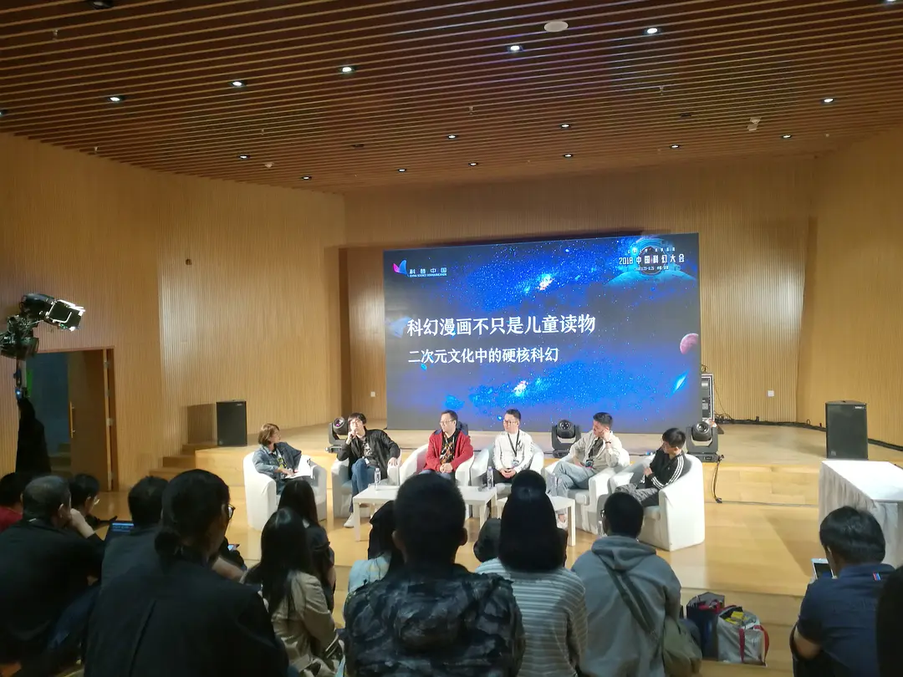
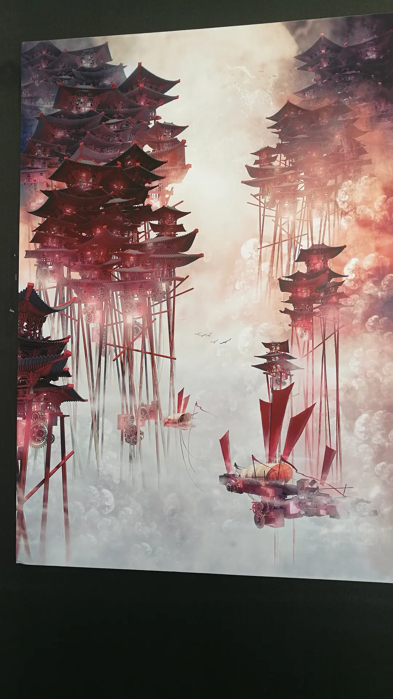
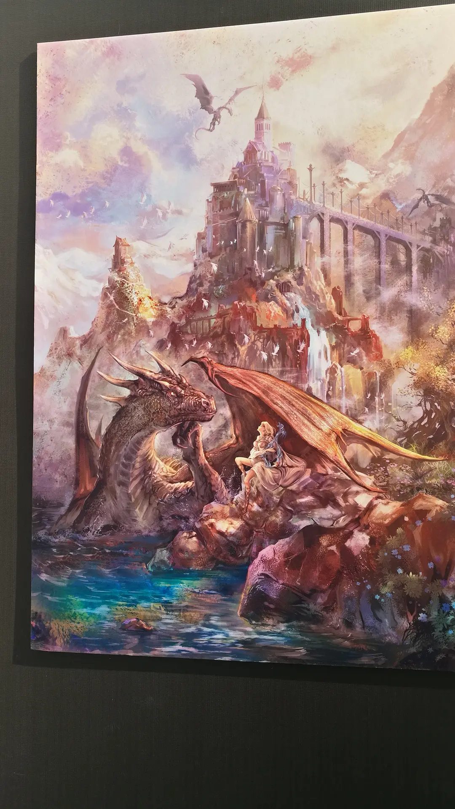
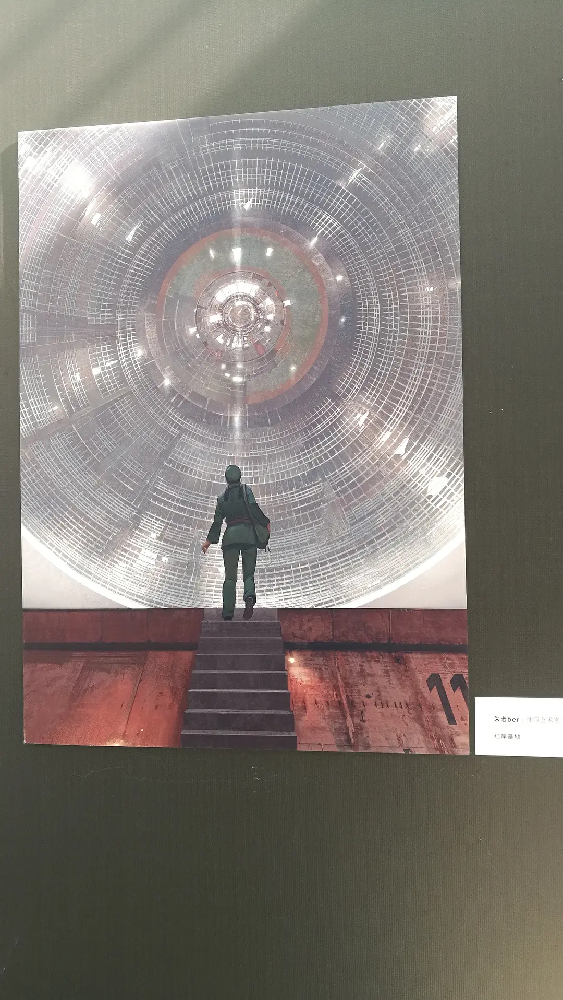
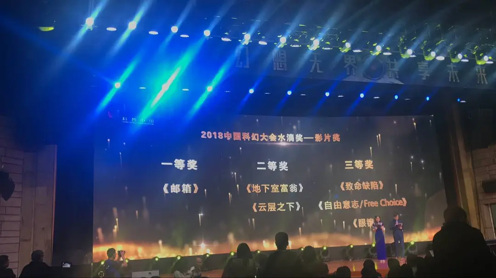
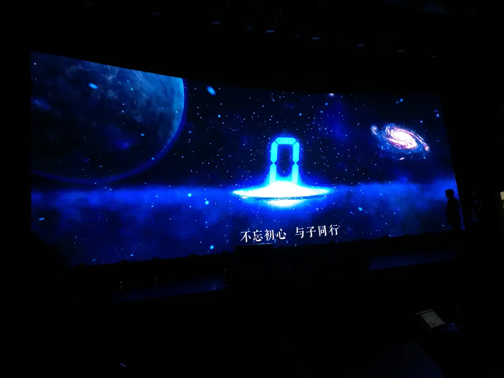
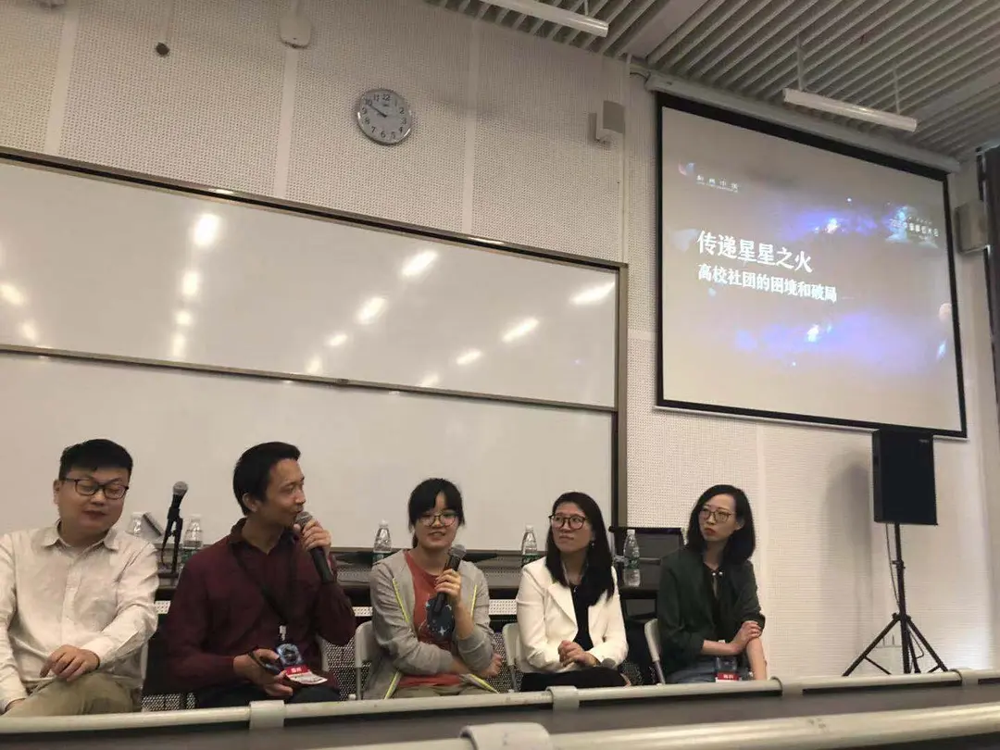
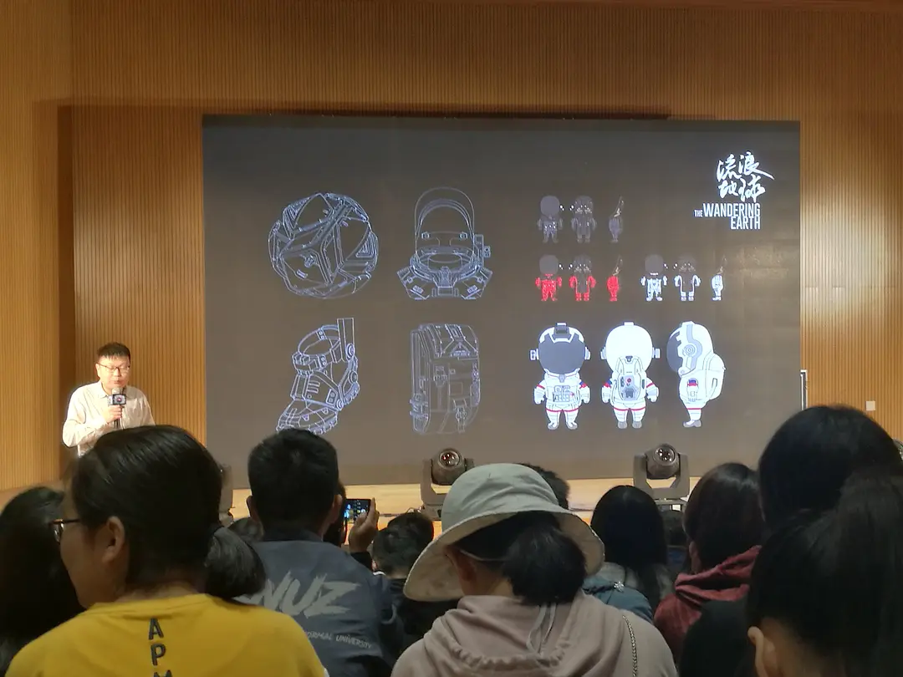

# 中国科幻大会观察日记

**文 Axiwa**

**图 Axiwa**

## DAY 1
接收到微像文化发出的邀请之后，由于时空转换进程的延迟问题，公元 2018 年 11 月 23 日凌晨 4 点，交大科幻协会派出的观察员 SFA-13-1 和 SFA-16-1 抵达深圳。5 个小时之后，2018 年中国科幻大会在深圳大学开幕。

<figure markdown="span">
  
  <figcaption>想要一套风暴兵的装备</figcaption>
</figure>

严肃活泼的领导致辞之后，迎来了激动人心的一幕: 国内主要科幻机构联合而成的银河科幻联盟和全国高校科幻社团联合的高校科幻联盟成立。国际化的未来者说-凡尔纳培养计划也在这里启动。科幻本身带有的中二色彩在这里更加夺目和可爱( ᵒ̴̶̥́ωᵒ̴̶̣̥̀ )

<figure markdown="span">
  
  <figcaption>感谢把科幻当做事业的人们</figcaption>
</figure>

<figure markdown="span">
  
  <figcaption>中二程度爆表</figcaption>
</figure>

<figure markdown="span">
  
  <figcaption>小伙伴们十分帅气</figcaption>
</figure>

紧接着会场来了一位不速之客，一言不发地走向吴岩老师，只为了从外空间带来一份《 2018 科幻产业发展报告》。从数字中可以了解到科幻事业在 2018 年再次有了飞跃，但仍需要大量的的优质作品和新鲜血液。

<figure markdown="span">
  
  <figcaption>星际快递小哥</figcaption>
</figure>

科幻大会由大大小小的分会场组成。SFA-16-1 参与了紧随开幕式之后的高峰论坛，张冉作为主持人，与嘉宾们讨论了科幻，尤其是科幻影业的发展。略丧的“每年都是科幻电影的元年”梗让观察者注意到各位改变和挑战的决心，也期待明年就是真正的科幻电影元年吧！《流浪地球》的编剧龚格尔在被问到“如何用特效处理大刘作品中瑰丽的想象”时，连连表示会剧透，引起一片猜测声。 他说: 《流浪地球》最大的价值，在于这种“走了也要带走家”的农耕文化与西方那种大航海时代以来的思维方式之间的碰撞。

女性作家专场邀请到四位女性科幻作家讨论她们的创作心路历程。写作时的性别视角，对社会对女性科幻工作者的偏见，生活中影响走向科幻道路的人和事……女性特有的细腻和感性在小小的房间里弥漫。对于近年来国际科幻文学大奖得主女性居多的奇怪现象，赵海虹老师表示，界内普遍承认对于男性来说，他们更愿意选择编剧影视这方面的工作，比起小说，这是更有挑战性也能够更快上升的方式。

二次元中文化中的硬核科幻专场则是漫画家和产品端的对话。热爱二次元和幻想的插画师们，入坑的经历竟然出人意料的相似，也再次让大家回忆起充满梦想和未知的童年。一个重要的结论是: 漫画的品味与国家的国运息息相关。美国漫画的黄金、白银时代的超级英雄无一不拥有非常硬核的科技设定，而到了黑铁时代，美国的工业空心化，奇幻和妖魔鬼怪就繁荣了起来。日本也是一样，直到前几年，才有《进击的巨人》这样拥有宏大设定的作品问世。

在会场晃悠的过程中，除了和各路网友面基，见到来自全国各地的小伙伴，不仅有同为科幻社团代表的复旦川大北师北航清华天大等等学校的同龄人(得到了友协的珍贵礼物)，也有微像等等科幻机构的各种大朋友。苹果核 & 华文真子集摊位上，可爱的华文带来了各种厉害有趣的科幻作品收录集，社长非法出版物(误)，马门溪龙专属徽章，不过最引人注目的要属机械发条跳蛙玩具，按一下 -1s，很刺激。

<figure markdown="span">
  
  <figcaption>来自友军的礼物！感动</figcaption>
</figure>

现场的科幻画展示让人流连忘返。很多作品并不是手绘或者数位板，而是通过编程完成的，宏大的意境和极致的细节让人心生向往，对未来场景的描绘中也透露出特有的思考。

<figure markdown="span">
  
  <figcaption>经典鲨鱼丹画风，科幻世界封面既视感</figcaption>
</figure>

两位观察员和 NCC、杨枫.tex、华文相约一顿沙县小吃后，来到晨星奖/水滴奖/银河奖颁奖典礼现场。

在颁奖台上看到众多熟人和新人的面孔，站在台前的新人们都很感动，写作路上的鼓励让他们坚定了继续的决心; 作家前辈们也幽默风趣，互相调侃中，阿缺阿老师和冉爷的互相伤害将气氛推向了高潮。

大家都在感叹作品的质量越来越高了，这让代表协会来拿[水滴奖科幻影视作品三等奖](https://www.bilibili.com/video/BV1pt411X7UG)的 SFA-16-1 感到微妙的愧疚和动力。高校社团的小伙伴们也都有所斩获，会场下充满了快活的气息。

最科幻的奖当属银河奖最佳游戏奖《王者荣耀》，群友讨论后发现王者荣耀的背景竟是如此硬核。腾讯爸爸此举也引起了诸多争议，那么就一起期待明年有更多优秀的科幻游戏作品问世吧。

<figure markdown="span">
  
  <figcaption>虽然有种 AE 模板的既视感，但这么多年银河奖点点滴滴走过，实在感人</figcaption>
</figure>

<figure markdown="span">
  
  <figcaption>友协 & 我协</figcaption>
</figure>

由于需要准备第二天的主线任务，观察员进入休眠状态。

## DAY 2

SFA-16-1 作为高校科幻社团代表参与了上午对于高校社团的困境与破局的讨论。来自腾讯科普科幻的何建红女士，上海苹果核的侃瑜和丁丁虫，都是经常和高校科幻社团成员打交道的人，赛凡科幻空间的创始人孙悦，本身就来自四川大学科幻协会。他们也常常疑惑到底高校科幻社团缺的是什么。开始大家都开玩笑说一切问题都是钱可以解决的，但随着讨论的继续，达成共识还是缺人，缺的不是一起约电影吃饭的人，而是一起认真做事接锅，可以输出作品的，有凝聚力的团队。而这样的团队怎样建立，社会机构如何才能更好的把资源带到高校社团，如何才能得到更高质量的优质原创作品，很多问题因为时间关系还有待进一步讨论。复旦幻协会长表示太短了略遗憾。

 

必须赞美深大的食堂，明亮温暖，选择丰富，自助好吃，毫无交大特有的浓郁的工业冷淡风格。

下午是众人期待已久的科幻主题演讲 TED。众多大佬中，代表协会讲述科幻微电影《眼镜》拍摄经历的十六代目感到自己非常接地气。再次重温那段疯狂的时光，依然选择会继续探索和尝试。

 

微像的科幻作者谭钢则带来了娱乐力 max ＆技术力 max 的光剑剑术导论。Saber 原来是一种剑，其发明和发展，游戏中的剑术，光剑十六式……硬核而帅气的讲解使不少女生发出了迷妹的尖叫。

赛凡的创意，星所的陪伴，读客的尝试(不得不提银河帝国那阴印着本拉登头像的超级大腰封，是他们相当自豪的一次打开市场的思考结果)，脑机接口，守法的机器人，拉丁美洲的科幻……不论是脑洞大开的畅想，还是科幻之下必须面对的现实，嘉宾们都带来了自己的所见所感，充满未来感的对话一次次地冲击观众的神经。

<figure markdown="span">
  
  <figcaption>赛凡科幻空间</figcaption>
</figure>

<figure markdown="span">
  
  <figcaption>星之所在书店</figcaption>
</figure>

交大幻协小分队达成深圳聚首成就，据不完全统计至少有6位来自交大幻协的同志穿梭于科幻大会的各个角落，三位跨越了多个纪元的协会成员还乘此之际录制了为协会破冰祝福。

因为时空转换程序必须立刻启动，科幻大会剩下的精彩内容观察员们无法进行记录，只好搬运来自其他位面的冒险者手记。其观察细致/有趣/深刻程度实属经典，奉上[传送门](https://mp.weixin.qq.com/s/VmCJ-MG50pApJWuOgYLh4Q)。

感谢给我们参与机会的微像，感谢各位爸爸，感谢靠谱的学长 SFA-13-1 和帮我寄回毛巾(一位观察员竟然忘记了她的毛巾)的友协同志。那么，宇宙很大，生命更大，以后有缘再见了！

虽然旅途短暂，还要随时和时空转换程序的故障作斗争，但是看到来自不同位面的人们为着同一个梦想努力，所有的人都可以用梗和作品交流，为原来自己属于这么一个可爱的群体感到荣幸。科幻日益走向产业化系统化，吸引了更多目光，也需要更多创新和改变，也仍然有人凭自己的一腔热情继续做着基础繁杂而有重要意义的工作。和友协的交流让观察员学习到先进的组织方法，也感受到了很久不曾感受到过的用爱发电、为了协会的精神，以及同好们惊人的阅读量与优秀的创意(对下期微像高科基的作品非常期待了)。科幻是瑰丽绚烂的，也是硬核严肃的，是想象更是现实，交流让我们相遇和欢笑，也让我们思考和进步。

（文章于 2018.12.1 首发于[豆瓣平台](https://www.douban.com/note/698559564)，转载已获得原作者授权。）