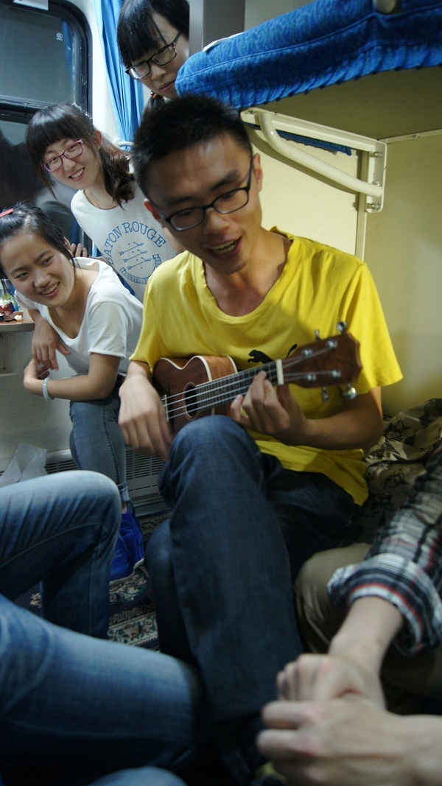
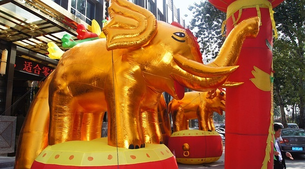
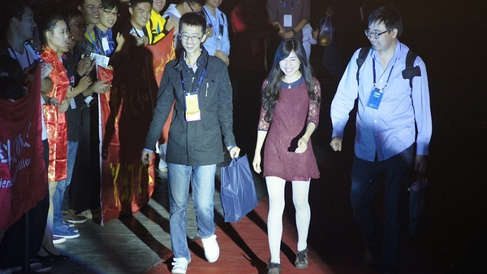
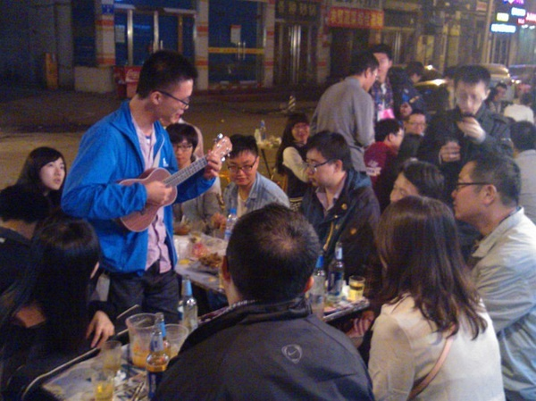

# 家住吴门，就作长安旅——记星云奖太原行
**文 青衫胖胖**
**图 青衫胖胖**

虽然作为交大科幻协会四代目，在上海高校科幻圈中辈分之高，唯宇镭可以PK，好像很厉害的样子，但我自己知道，我其实已经远离科幻很久了。大概09年起，科幻在我阅读书目中所占比例越来越小，杂志几乎不买(偶尔要看也是去知网)，协会活动也不怎么参加，各种策划更是撒手不理， Scific 板主也辞掉了。跟协会的朋友倒是照样玩玩闹闹，只是跟科幻几乎没有关系了。

直到这次“十一”以旅游为主要目的去了趟太原，忽然感觉对科幻的热情又回来了，好像一个年深日久的封印在阳光下瞬间灰飞烟灭。

## 10月2日

跟复旦、华政、上外贸的小伙伴在火车站会合，发现正好 6 男 6 女（无视隔了一节车厢的丁丁虫的话），于是男女生各一个硬卧包厢。所有人先挤在一起做了个自我介绍，发现大一大二的小朋友虽多，居然有两个比我还大几岁的。之后，就是自由活动了，把丁统也拉来玩了会“谁是卧底”，可惜大部分女生都被华夏的吉他吸引走了……活动期间复旦两个小学霸几乎一直在看书，天聪是研读英文化学教材，欣怡是看圣经历史，默默点赞。

玩累了之后，大家开始闲聊。不愧是幻迷啊，讨论的问题都很高大上，比如“怎么看待科学和人文的分裂趋势”，“科学发展中的各种错误思想是不是毫无价值，是不是该放入教材”，“当我们只是发现一个现象，还没弄清原理的时候，就开始尝试应用方面的设计，是不是合适”等等。期间也夹杂着谈了点专业选择、未来发展等话题，一直到半夜。

## 10月3日

早上七点多起床，窗外漆黑一片，开始以为北方黑夜长些，没怎么在意，直到大概半小时后，四周突然之间大亮，阳光明晃晃的，这才知道刚才其实在一个很长的隧道里。后来大刘在讲座时也提到了这点。

到太原后，大家决定走到宾馆去，一路上经常看到眼神有点忧郁的金色大象，估计是当地的吉祥物。

到了宾馆的会务组房间，苹果核来太原的人全都正式加入世界华人科幻协会，当时完全不知道这意味着什么，只是之前砍鱼说门票 120 ，但入会的话 200 ，免门票还管三顿饭，觉得多出的 80 好划算，光饭钱就赚了。之后的经历告诉我，最值的其实是入会，那意味着跟作家们一起吃饭开会，登舞台走红毯，颁奖晚会 VIP 座位……叩谢砍鱼Orz

中午砍鱼和学姐去找董仁威老师商议接下来的安排，其他人就近找了家饭店吃饭。还没吃完，砍鱼突然在微信上冒出来一句“董老师让我和学姐跟大刘一起吃饭”，集体喷饭……拷问出地点后，杀进他们包间求合影。虽然莽撞了些，各位老师倒也不以为忤，乐呵呵的一起合影，好几位老师要求用自己相机拍几张，董老师还发了微信。

合影之后，大家才安心去逛柳巷，先是去了老鼠窟吃元宵，然后又逛了下食品街，很多美食。学姐和砍鱼留在那继续吃饭，传闻学姐席间邀请大刘看电影，被大刘以已有家室为由拒了。

逛完回宾馆休息了会就是接风晚宴。以前熟悉的那些铅字一下子全部都化成活生生的人出现在面前，于是集体失控，各种求合影，唯砍鱼在一边恨铁不成钢：“不要这么脑残粉啊，矜持点，以前又不是没见过。”

无人理睬。

参加过大大小小无数会议了，这是我唯一没怎么吃饭的一次。

大刘挺萌的。

表情跟大刘挺同步的……

当然还得偷拍下科幻圈的几大女神，不然长焦何用：

饭后是会员代表大会，修正液涂改文件的“人艰不拆”就不多说了。总体印象是很多规则都有漏洞，不过主席团的各位老师都针对这些漏洞提出了很多修改意见，相信今后会越来越完善。不过靠媒体影响力刷大众投票这招会上好像还没提出好的应对方法，我觉得 IMDB 等电影评分网站的措施会有一定借鉴意义。另外，恭喜复旦学姐升为上海地区理事。

会后自然是夜宵了，丁丁虫在开会时就在不断召集了。宾馆外有三家烧烤摊，大家把选择权交给了学姐。学姐就带着大家在三家摊子外晃了一圈，然后选了中间的那家，理由是“第一和第三家的老板都来招呼我们，就第二家不理我们，所以就第二家了。”大家无语了一阵，也就从了。坐定后，丁统开始召唤茄子、宝树，过了一会儿，茄子他们来是来了，但看见第一家烧烤店外人很多，就直接在第一家吃了起来……于是我们这边的游戏惩罚都是去第一家店那边吸引注意力，什么送盘菜过去，抢盘菜回来等等，后面越来越羞耻，就不多说了。

好在茄子终于看不下去，带着吴霜和陈茜坐了过来，泪目。吴霜很大方的请所有女生喝东西，饮料杯很大，目测 600ml。我偷喝了一些，木瓜味的一般，芒果的非常好喝。之后继续猜数字，惩罚以表白为主，于是吴霜向大刘表白（具体见她 repo ），砍鱼向章正太表白，宇镭向飞氘和江晓原表白（其中对飞氘是用拉丁语），我向子十表白，一片混乱。不过轮到我时，子十很聪明的猜出我们在玩大冒险，我就迅速表白了事。结果群众表示不过瘾，温馨就把我手机给了夏笳，茄子让子十猜自己是谁，三次机会。结果他连错两次后有点不耐烦了，放弃了第三次机会。温馨就告诉他真相，当时他就震惊了，连忙要求再跟茄子说话，可惜十动然拒。哦，对了，丁统被惩罚仰天大喊“亚美爹”了。

## 10月4日

上午到煤炭交易中心进行开幕式，整个中心是飞碟形的，由中心辐射出两个方向的桁架进行支撑。

那里正在举办山西动漫节，正好借一堆动漫妹子暖场：

之后是作家们集体亮相：

果核众的cos：

上午的讲话都没怎么听，四处闲逛，发现有个对转桨的直升机。想起上次去“万有青年烩”撕丝袜，发现了个对转桨风车（后来在骑车去实验室的路上撞树上了……），当时就暗下决心，回去博士论文里也搞个对转桨玩，不能被玩具厂商比下去。

上午活动快结束时，我跟华夏说去找动漫妹子合影吧，华夏连忙拉住我，让我先别动：“我观察宝树好一会儿了，他是死宅，之前一直在看动漫妹子，我估计他要去求合影了。”我连忙看去，10秒不到的时间，宝树果然借着跟幻迷合影的机会拉了个动漫妹子来一起拍照……

中午在交易中心二楼吃饭，坐在宝树旁边，正好完成镇会之宝。

期间夏笳不知怎么提到自己有腹肌，宝树嘟囔了句“不会吧，好可怕”，于是夏笳就把手机里的自拍照递了过来……有幸一睹，其实还好，不是很明显。

因为盒饭没有肉，就跟陈茜以及其他人去外面的六味斋买了些酱肘子酱牛肉之类。回来后换温馨坐在宝树旁边，她幸福的在微信里说：“坐在宝哥哥旁边，吃吃东西聊聊小说，唉，日子啊……”一副夫复何求的样子。后来砍鱼又抱怨我们的脑残粉行为时，温馨突然说了句：“我保留了宝哥哥的饭勺，再给我一个egg，我就能复制一个宝哥哥了。”这事之后，砍鱼再也不说我们了。

胸罩外穿的小姬代表果壳网签约，明年将在北京承办星云奖。

下午论坛的内容韩松博客里已经记得很详细了，也不赘述。总的来说，有点仓促，讲演时间不足，也没有提问时间，明年应该会改进。

晚上回山西面食馆，果核众去得晚，插入各桌吃饭，学姐挨着大刘，华夏跟刘淼一桌。我挨着刘兴诗老先生，无奈他的作品一部都没读过，同桌小庄的《性与爱的实验报告》倒是读过，不过有老先生在，又是吃饭，也就没聊读书心得。

吃完饭就是去南宫广场走红毯，果核众也上去了。

走完红毯的嘉宾可以签名（签名墙图片来自专业摄影师@峰兄在微博，题词是“历史被铭记，就不曾忘记，也就成为了时间的鉴证。”），我自忖这几年没为科幻做过什么，所以没去签，只是想着这帮默默耕耘的家伙终于有点明星般的待遇了，微微感动。

颁奖晚会上，有交响乐团演奏动漫歌曲，久石让的曲子被一再演绎，但最激动的还是听到《圣斗士星矢》的主题曲。颁奖结果也不多说了，到底多年不读科幻，很多都没看过，不便置喙，只是觉得有些争议，无关星云奖的品格，而是规则制订的疏漏。

颁奖结束后苹果核与老王、姚编、丁统、陈茜（小姬）的合影。后来还找小姬要了些零食……

晚上又是夜宵，这次大部队集中在第二家店了。期间顾备老师来找丁统商谈聚集上海科幻圈的人马进行定期沙龙，或者找高校老师进行前沿知识讲解。我跟她打了个招呼，就被吐槽了之前在交大的两次活动，还好她的主攻目标是丁统。不过顾老师的想法挺好，这个月应该能尝试第一次活动了。

夜宵中最出名的事件就是大刘跟何夕的基情了。他们开始时认真回忆之前的几次碰面，然后何夕跟大刘开了句玩笑：“你忘了大明湖畔了吗”大刘愣了一下（他没看过还珠），说：“科幻圈开会一般就在北京、上海、成都嘛，什么时候去的济南大明湖？”苦思冥想许久，依然想不起来。何夕突然幽怨的来了句：“你个没良心的。”周围顿时炸锅，小姬连忙表示自己不该坐在他们之间，太多余了。

又吃喝了会，华夏开始才艺表演，《胸毛之歌》。歌词自行百度，总体感觉跟《织毛衣》一样——初看粗鲁猥琐，细品却有切实的悲哀。

这次夜宵持续到凌晨两点多才结束，夜寒料峭，王维剑便把自己外套让给茄子披，点个赞。(我和学姐听说后的第一反应都是“原味啊”，罪过。)

## 10月5日
果核众都睡了个懒觉，中午起床后去食品街的雪山冷饮自助餐厅吃饭，鸡肉、牛肉、鱼虾、冰激凌都不缺，这样的自助也才 45 块一个人，太原物价还是比较低的。

下午去了趟山西省博物院，东西很多，讲述了太原从原始社会直到明清的历史，非常值得一看。有两个地方有点意思，一是有一层展出了几百个布币，看着几乎一样，但博物馆硬是分成了几十个种类，陪同的太原幻迷说他来过十次了，也没看出什么区别。二是看见了一个弥勒的玉像，旁边的注释没有称他为佛，而是叫他菩萨。回来一查才知道，弥勒就是菩萨果位，因为佛祖预言他是下一个佛才被人们尊为佛，但实际并未成佛。

晚上大部队都回上海去了，我和砍鱼、宇镭继续在太原晃。我和宇镭一再表示要去看《神都龙王》，各种理由都用上了，什么“楚惜刀改编剧本写的小说，也算科幻圈的东西”，“大刘好几次专门跑到上海看 IMAX，我们从上海跑到太原看电影，是反 COS，是行为艺术”等等，可惜都被否决了。最后被决定跟着一个太原理工的同学去看当地一家的科幻主题咖啡馆。

在酒店大堂等那位同学时，又碰到了大刘和何夕，他们在等小姬下楼。有一个幻迷过去跟他们拍了张裸眼 3D 的合影，于是大家开始聊 3D 影像技术。我趁机向大刘介绍了下自己实验室的 3D 虚拟建造船舶、模拟实船航行的技术，旁边的何夕却在无奈的感慨，因为自己瞳距过大，有 76mm，3D 对他完全无效……

大刘他们离开后，我们就去了那家咖啡店，店名叫“巨点公社”。铺面不大，不过却有四层，第一层是吧台，不止咖啡，还卖酒，二、三层可以聊天、看书，第四层可以放映电影，麻雀虽小五脏俱全。不过里面的书各方面都有，其实不好算科幻主题，不过听说店里经常组织一些科幻沙龙。

我在吧台点了杯金汤力后，发现面前的杯子里有几片小的夹心饼干，看着很好吃的样子。就向老板要了一个，老板说这是女服务员做的，要问她。我看服务员只是腼腆一笑，没有反对，就吃了，口感酥软香甜，意外的好吃。于是向老板再要一个，老板苦笑了下同意，待我吃完后说，这叫马卡龙，是法国甜品，制做工艺复杂，外面甜品店一般卖 13 元一个（后来发现在上海卖 20，一个也就一元硬币那么大）。于是很识相的没有再吃，去三楼玩牌了。

玩牌时，砍鱼向我普及甜品常识，告诉我马卡龙又被称为“少女的酥胸”，想起《乳赋》最后几句：“除却一身寒风冷雨，投入万丈温暖海洋。深含，浅荡，沉醉，飞翔。 ”倒也贴切。

离开咖啡店时，成功说服老板 10 块钱卖我第三块，真好吃啊……

## 10月6日
白天去平遥走马观花了一趟，巧遇顾备老师，人品真好。

晚上转道北京，跟砍鱼、宇镭逛了下后海，看见一只活的草泥马。

## 10月7日
与北大科幻协会的张宸元以及七代目方水石一起刷全聚德，一个住在天津的师弟也赶过来了。方水石一头长发，极富艺术家气质。而张宸元是章正太的初中同学，曹姐姐的高中同学，六度空间啊。期待明年在北京与他们再次相见。

下午高铁回上海，至此整个太原行结束。

回顾整个活动，最大的感慨跟碳基生物一样：只要你肯回来，圈子一直都在。尽管我从 09 年开始淡出科幻圈，但我可是从 97 年就开始看科幻的呀，对科幻的热爱早已深入骨髓，哪怕离开一段时间，但再回来时，依然能轻松融入整个圈子。整个太原的行程固然让人激动，但我最怀念的还是去的路上，跟苹果核的其他人一起讨论科学发展等话题，很久没跟人聊这些了，而有些话题也只有在科幻圈里才能毫无滞碍的聊吧。回想起了 09 年前的那些日子——几个月内三十多次更新 Scific 板 ftp 里的影视剧，在牛马社连讲三小时世界科幻史扔意犹未尽，跟六、七代目等人一起殚精竭虑拿下两次“十佳社团”称号……

后来怎么就都不做了呢？那些作家哪怕所得微薄，也几十年如一日的创作；那些志愿者千里迢迢赶赴太原，没日没夜的操劳；Scific 板的一些老前辈，直到现在也一直阅读、评论科幻作品。也许是时候回到圈子，继续做一些事情了。

五载隔音尘，今我复重来。

（文章于 2013.10.14 首发于[豆瓣平台](https://www.douban.com/note/310338834)，转载已获得原作者授权。）