# 交大幻协活动掠影2002-2024

## 2002.9.26

和上学期招新时一样，正碰上小雨。

两张桌子，一块黑板，还有十来个干事在忙碌。

……交大的科幻迷果然是很多啊！

宣传的方式，好像是利诱为主：） 

黑板上挂着几本科幻世界，然后拉住人就说“现在入会，免费赠送杂志啦”。

印制的那张宣传单还不错，制作得挺精美。

宣传词是：

历史与未来 文明与毁灭 浪漫与理智 梦境与现实

——Swordsp (网络流·停止冬眠) 饮水思源BBS SciFic版
## 2002.11.16

沉寂了许久，我们的协会在期中考试过后又重新开始活跃了。

首先是协会的主页展示，历经两次改版……地址是www.51kh.com，大家有空多去看看吧。

后面的科幻主题讨论，居然叫做“阅读理解”！……选的文章是阿西莫夫的短篇《眼睛不仅用来看东西》后面列举了数个讨论的主题，有选择题、问答题、论述题。虽说足够出人意料，不过总觉得太正规了些，每道“题目”还标注了分数，汗……

接下来是科幻作品有奖竞猜活动。现场科幻迷的记性还真不错，每一篇都有好几人答出，连一些细节都能记得那么清楚。

美中不足的是，奖品实在不够科幻，居然是——绒毛玩具！如果是ET模型还差不多……

——Swordsp (网络流·停止冬眠) 饮水思源BBS SciFic版

## 【投票：2002年银河奖花落谁家】

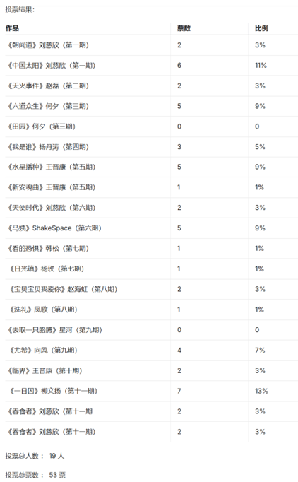

——饮水思源 BBS SciFic版
 
## 2007.5.31

**奇幻交流活动，与华师大。**

嘉宾：大角（潘海天）

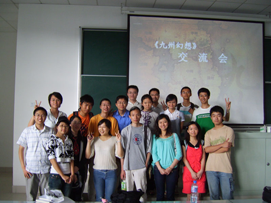

——windynes (ＳＳ跑轮跑的欢) 饮水思源BBS SciFic版
 
## 2007.6.6
**科幻辩论赛**

——dfttt (不求甚解) 饮水思源 BBS SciFic 版
<figure markdown="span">
  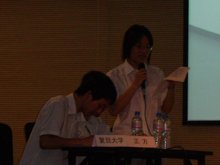
  <figcaption>复旦大学</figcaption>
</figure>

<figure markdown="span">
  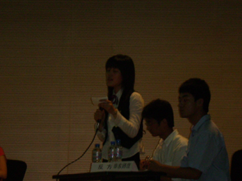
  <figcaption>华师大</figcaption>
</figure>

<figure markdown="span">
  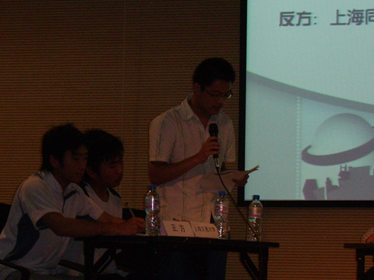
  <figcaption>交大</figcaption>
</figure>
 

<figure markdown="span">
  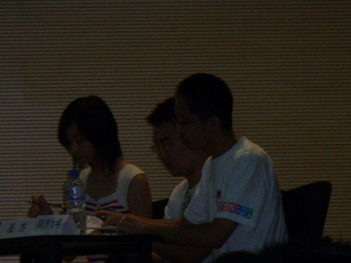
  <figcaption>同济</figcaption>
</figure>

<figure markdown="span">
  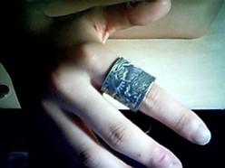
  <figcaption>奖品</figcaption>
</figure>

 
## 2008.5.24
<figure markdown="span">
  
  <figcaption>饮水思源BBS SciFic版 线下版聚合影</figcaption>
</figure>

## 2008.5.26

**神秘小屋（鬼屋）**

——christfake (赝品上帝) 饮水思源BBS SciFic 版

这是一场源自激情的华章——谁说当代缺乏创意，我们用精致用心策划作为反驳；谁说如今丧失活力，我们用齐心协力克服困难反对；谁说现实没有奇迹，不，现实有奇迹，我们用平地而起的废品小屋证明。

<figure markdown="span">
  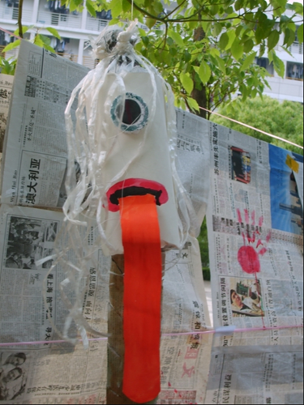
</figure>

## 2008.10.23
**科幻粘土成果展**

——demonyang (恶魔之羊) 饮水思源 BBS SciFic 版

去的人不多，但是还是很好玩滴~

晚上有小盆友说，希望以后还要搞这样的活动，感动一记~

<figure markdown="span">
  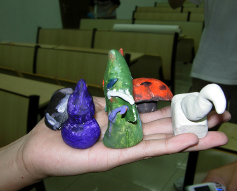
</figure>

## 2008.12.11

**科幻周之幻迷聚会——荒野黎明**

<figure markdown="span">
  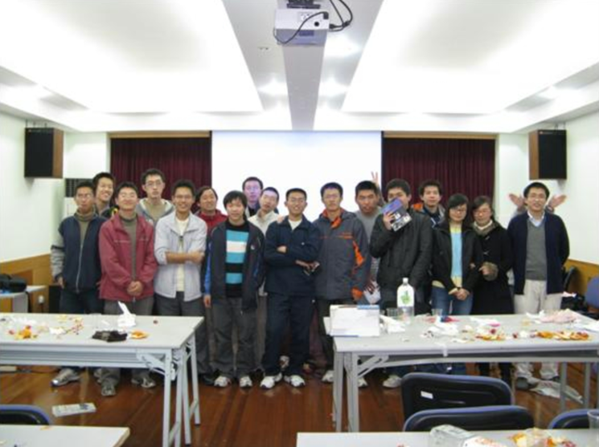
</figure>
 
## 2009.3.26
——饮水思源BBS dfttt (不求甚解)
<figure markdown="span">
  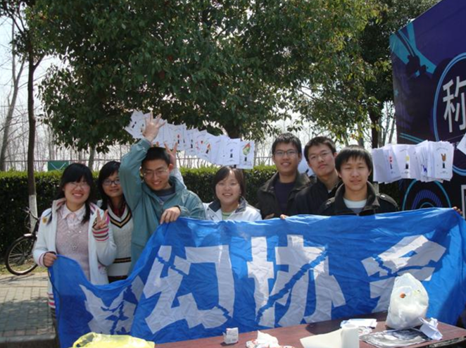
  <figcaption>“地球一小时”指印蜡烛</figcaption>
</figure>

<figure markdown="span">
  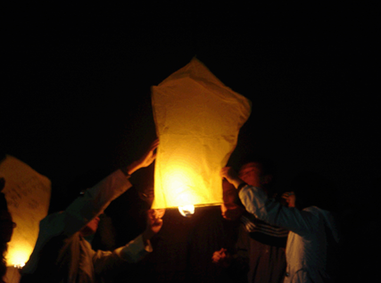
  <figcaption>施放孔明灯，讲鬼故事，玩狼人杀</figcaption>
</figure>

## 2009.3.29

**制作社团刊物 TRANS**

上海交大科幻协会开展TRANS活动已有2年，活动旨在翻译一些国外的科幻、奇幻作品，以短中篇为主。希望对科幻有爱并能持之以恒的朋友加入到我们的活动中来。

我们去年将上期翻译的作品集结成册，将售出的收入都献给了灾区同胞，其余供内部传阅。我们希望今年也能组成一本翻译文集。

## 2010 3.23-25
**《科幻世界》倒社风波前后**

*andrewsun (inHK)：*

那么就科幻世界这件事，我们作为一个读者可以做点什么呢？

我们可以从现在开始拒绝购买质量粗劣的科幻世界，并号召自己身边尚不知情的科幻迷们也参与到拒绝购买的行列中来。 我们可以参与民间的一些网络签名活动，表明自己的态度。 我们可以给四川科协打去投诉电话，大声说我们对他们的行为非常不满。 我们可以写信给科幻世界编辑社，告诉他们我们一直以来都很支持这份杂志，并反对把它搞成一份不伦不类的三流商业刊物。

这都是我们可以做的，并不困难。这样才能改变中国。

*dfttt (不求甚解)：*

虽然有些事情，我们还无力改变。但至少，我们能够给那些在艰难的环境中，仍坚持着理想的编辑们一些鼓舞、一些温暖。谢谢他们，曾经给我们带来那么多美妙的文章，提醒他们，还有许许多多的读者在默默支持。

3月25日（本周四）中午，科幻协会在东区大转盘等着大家，让我们签下自己的名字，尽自己绵薄之力帮助科幻世界众编辑们，相信他们能走下去的！

PS：我们的横幅会寄给编辑部，而不是四川科协，所以恳请大家尽量不要使用攻击性的语言，而是多些对那些可敬的人们的鼓舞。

*dxx (独行侠)：*

也有很多人留下了很多话，很高兴看到科幻世界的粉丝们都过来留下对她的祝福 

总之谢谢大家了，我们马上会把签满字的横幅送过去的 

希望能最大限度地鼓励编辑们吧 

这一关冲过去，相信会有更好的明天~

## 2011.9.14
<figure markdown="span">
  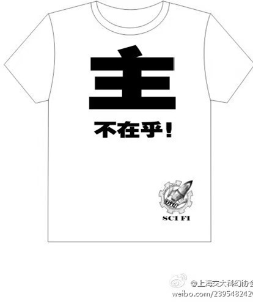
  <figcaption>制作三体文化衫</figcaption>
</figure>

 
## 2011.9.18

<figure markdown="span">
  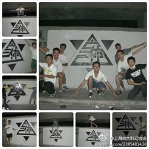
</figure>

集体通宵制作国内首面三体墙，本来计划加上标语"推翻人类暴政,世界属于三体"，但制作过程被两名校警严密监控，甚至招来了警车，非常紧张地询问"三体"是什么意思，口号自然无法见光。
 
<figure markdown="span">
  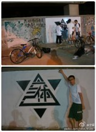
</figure>
 
<figure markdown="span">
  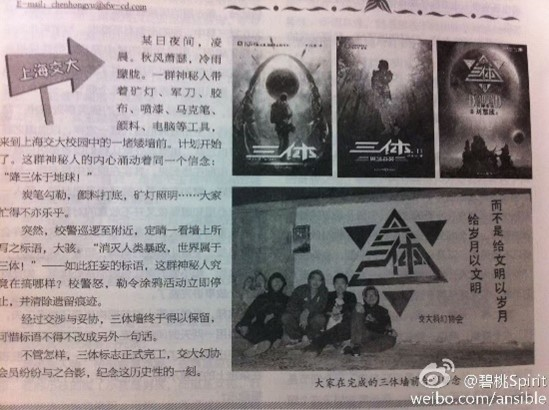
</figure>

## 2012.9.25
**科幻协会招新摊位**

<figure markdown="span">
  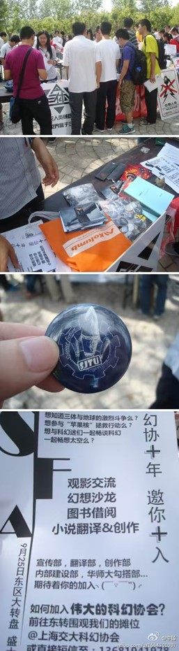
</figure>

## 2013.10.31

**学人书店·阿西莫夫专题沙龙**

<figure markdown="span">
  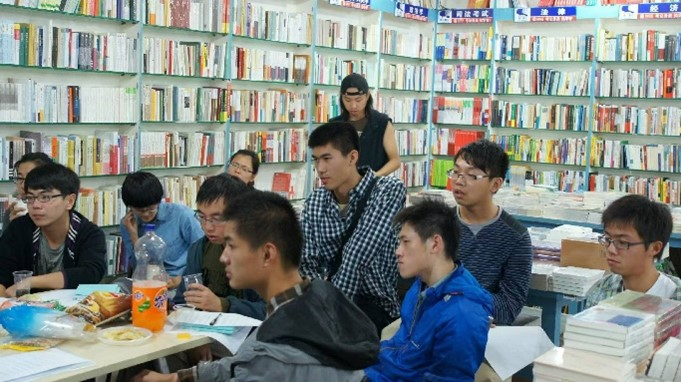
</figure>

## 2013.11.15

**交大幻协新书，参照MIT书单**

<figure markdown="span">
  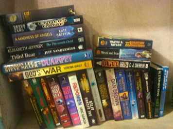
</figure>

## 2014.5.25
**上海苹果核幻想节交大场**

嘉宾：宝树、飞氘

<figure markdown="span">
  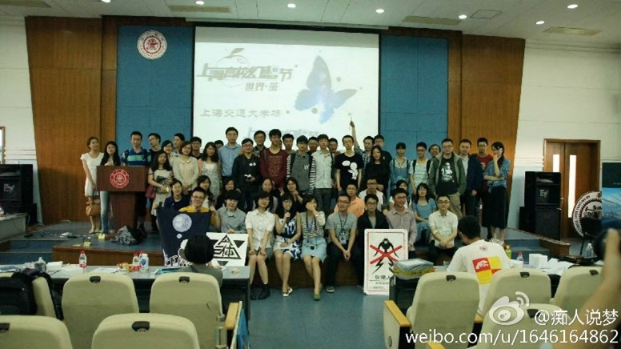
</figure>

## 2015.11.4
**协会藏书**

<figure markdown="span">
  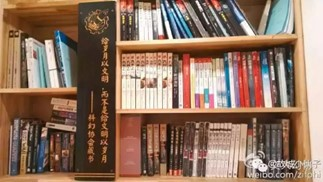
</figure>

## 2015.10.28 
张冉读书会：张冉 "能归于科幻的，都是极度理性又富预言感的作品"
## 2016.3.9 
科幻中的历史——真实记叙的过往，以及，更多的可能性
## 2017.3.27
**佘山天文台观星**
<figure markdown="span">
  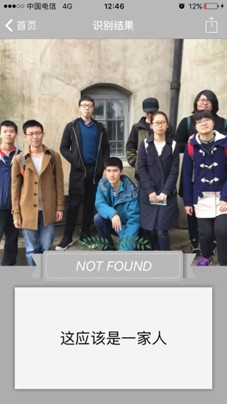
</figure>

## 2018.3.10

**观影与破冰**
<figure markdown="span">
  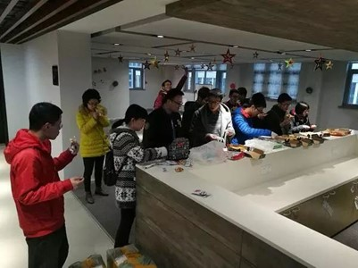
</figure>
 
## 2018.4.8
**激光切割的幻协徽章**
<figure markdown="span">
  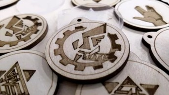
</figure>
 
## 2018.7.15

**第二课堂TRPG知识科普与玩耍**
<figure markdown="span">
  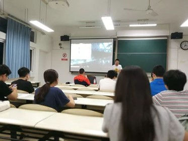
</figure>
 
## 2019.11.30

**在蔚芝书店打桌游**

<figure markdown="span">
  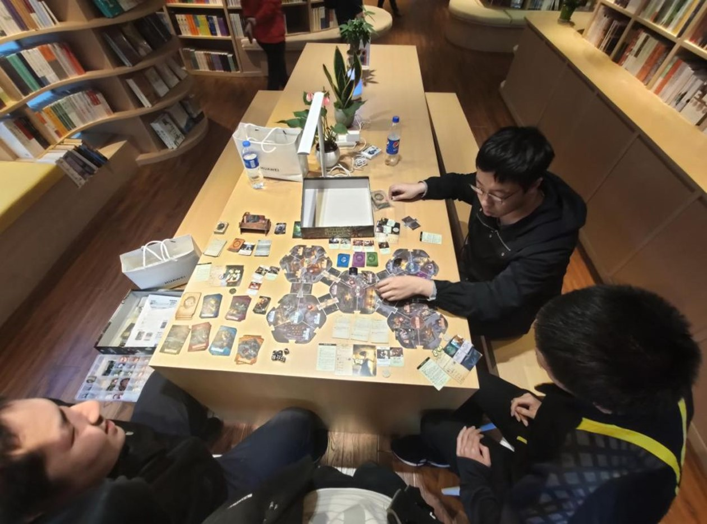
</figure>

## 2020.2.1
**空想读书会——线上版**

内容包括：

穿越时空抗击邪神拯救妹妹的科幻史诗

《非对称性时光机》

以及

拥有硬核书名与神奇内容的菜谱

《血与花》

## 2021.8.1
**魔都高校幻协科幻接龙**

故事背景：

赛博时代，人类大量使用机械义体，意识上传成为可能。人类建立了电子冥府，将死去人的意识放入电子空间使其永生，因而形成了阴阳两界、黑白无常和十殿阎罗。

## 2022.1.2

**魔都高校社长见面与杂谈**

<figure markdown="span">
  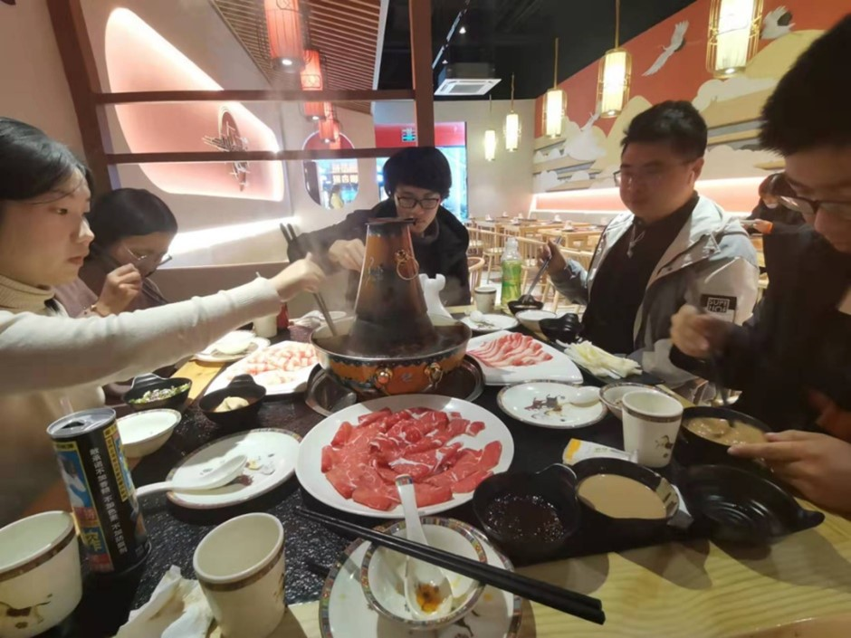
</figure>
 
## 2023.9.23-24
**交大幻协成员参与“另一颗星球“科幻大会**

<figure markdown="span">
  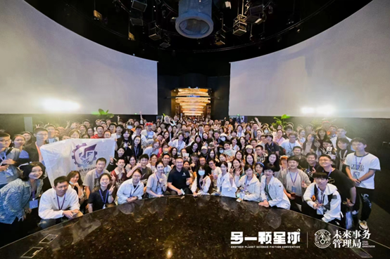
</figure>

## 2024.3.31

**讲座：太空歌剧：从《沙丘》到《星球大战》**

嘉宾：南方战士

<figure markdown="span">
  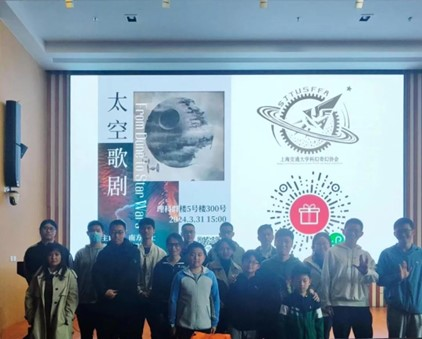
</figure>
 

