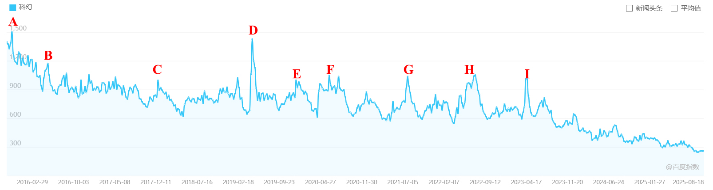
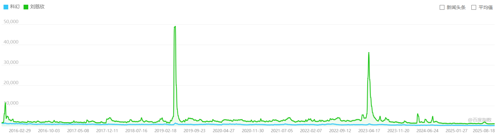

# 给中国科幻一粒西地那非
**文 戈仑石人**

笔者今年目前最喜欢的科幻段子是：邓紫棋成为了中国科幻第二人。笔者没有任何抨击她的意思，也没有心情去看那本小说。笔者只是为中国科幻目前的现状感到诡异。

科幻是一个很奇怪的艺术类型。他就像一个你谈了很久的男友，一米八四，美型身材，别人都竖起大拇指夸未来他无限光明，只有你知道他阳痿。

确实如此，当我们聊起科幻，大家似乎都对它能说出一些关键词：对未来的幻想，战舰，宇宙，刘慈欣，《三体》，令人艳羡的爱情……似乎人人都能说出《三体》中的一些名句，但又没多少人认识除了刘慈欣以外的科幻作家。回到中国科幻本身，也确实没多少人给他花钱。一本新印的科幻小说能卖几千本就算现象级作品。据说《时空画师》卖了十万本，但buff叠满的《海漄怪奇故事集》也才卖了两万本。真不知道中国科幻刘慈欣以外的作家卖的书全部加起来有没有他一个人卖的多。

至于科幻业界的衰落，似乎也不必多言。这种衰落，在高校创作群体似乎感受更甚。笔者已无心再聊这种衰亡，之前也已写过数篇文章畅谈。只提数月前与科幻世界某编辑吃饭，得知了一些行业内幕，颇为感慨。

笔者确实更感兴趣之事，是科幻这个标签，在科幻圈内外——抑或直接以是否科幻迷之称——为什么有如此大的区别。
25年发布的双人合作游戏《双影奇境》中，玩家需要操控两名作家角色在各自创造的科幻与奇幻作品之间切换。在这些由她们文字创造的世界里，玩家们能体会科幻的魄力，或者奇幻的神奇。但游玩结束，笔者失望的发现游戏中所有的科幻元素无非是耳熟能详的赛博朋克，宇宙飞行，空间站之类。游玩久竟颇审美疲劳。

很早之前，笔者在担任某科幻小说比赛评委时，就看到一篇关于科幻之死的小说。无非是科技停滞，科幻未来也消失云云。

但阅读的科幻作品多了，在科幻圈内混久了，很容易发现科幻的定义已经从单纯的科技幻想小说，拓展成了科学幻想小说。社会科学幻想《1984》，历史重构《高堡奇人》，甚至奇幻都有隐隐与科幻合并的趋势，例如刘宇昆的《狩猎愉快》。笔者很难说这种定义扩张是好是坏。至少在笔者看来，这是圈内外的一种定义错位。

而这种定义错位，是当代中国科幻难以进一步发展的重要阻碍之一。

第29届中国科幻银河奖最佳科幻游戏奖颁给了《王者荣耀》，第35届则颁给了《鸣潮》。米哈游知道自己没获奖都要哭晕了。这些游戏可以说与科幻有些关系，但有很大关系又不太可能。笔者甚至不太清楚游戏官方知不知道自己拿了奖。毕竟《鸣潮》没有因为拿了银河奖给玩家发十连抽。

在百度搜索指数中查找“科幻”，从2015刘慈欣获得雨果奖到如今十年，搜索的数目整体呈下降趋势（不必多说）。但在下降的曲线中，我们可以看到几处搜索量变化的极点。在互联网进行搜索后，可以得到这几个极点发生的事件：

A：2015年8月：刘慈欣获雨果奖。

B：2016年3月：中国科幻作家刘慈欣当选山西作协副主席。

C：2017年10月：《银翼杀手》全球上映。

D：2019年2月：《流浪地球》上映.

E：2019年9月-10月：《上海堡垒》上映.

F：2020年上半年：叮咚鸡。《我的三体之章北海传》上线.

G：2021年5月：《球状闪电》电视剧官宣海报。

H：2022年3月-5月暂未查到标志性信息，可能是上海封城。

I：2023年一月：《流浪地球2》上映。

可以看到，在中国科幻圈产生热度的事件，大部分都是影视剧集，而且还要和刘慈欣相关。本来想象当中的世界科幻大会，《宇宙探索编辑部》等科幻大事件，在搜索热度榜中甚至处于低谷期。

这说明，在圈外人——或者说大众来看，只有满足这些tag的事件或作品能被收到关注。而刘慈欣本人的作品风格，就几乎塑造了大众对“科幻”这个词语的定义。

那么，刘慈欣为什么会受到大众的关注？进而导致圈内外对于科幻认知的错位？笔者认为原因有下：首先是作家作品质量自身过硬，其次是刘慈欣是第一个获得雨果奖的中国科幻作家，我们都知道，人们往往只会记住第一，而不是第二。这也可能是同样是雨果奖，《北京折叠》和《时空画师》为什么没有引起热潮的原因。最后，是影视化对刘慈欣反向的曝光。

同样，在百度指数输入刘慈欣，可以得到对比的搜索指数曲线图：

没错，这俩及其锐利的尖峰就是两部流浪地球。

但当我们输入“三体”，可以得到让我们更加忍俊不禁的图片：

这说明，人们对作品的关注是要大于作者大于类型的。

经过上文的讨论，我们似乎已经对圈内外对于科幻定义的区别产生差别的原因有了些许结论：科幻种类固有很多，但因为刘慈欣的先行推流，只有刘慈欣式的科幻，或者说《三体》、《流浪地球》类的科幻，能够“出圈”，被大众所知，或者被自动归类为“科幻”。而两部《流浪地球》的影视化，进一步固定了刘慈欣对于中国科幻的象征性。

比如社科科幻《1984》，在世界文学的地位绝对远超《三体》，但是很少见人在推荐科幻时会推荐它。

好了，事已至此，那么，我们应该如何让中国科幻重振雄风呢？

首先，曾经的推流导致了目前的刘慈欣式科幻在大众之间产生了刻板印象，最简单的办法，就是继续影视化改编刘慈欣的作品，改编的不好有黑流量，改变的不好有红流量。同时，让刘慈欣继续创作，再进行大规模宣发。如果大刘能在流浪地球三上映的时候写出一本长篇集，这本集子可能能继续引领中国科幻的风向。

其次，就是让目前的还在创作的科幻作家的创作质量提高。这样在《科幻世界》进行推流后才能抓住机会。然后快速进入影视化阶段。影视化的视觉效果可以大幅提高创作质量的上限。

最后，多发掘新星作家。《科幻世界》，《科幻立方》等杂志仍需大力发展。造神容易，再造一个又是什么难事吗？当然，目前高校的科幻创作比赛主观感受是越来越多，但是读者似乎越来越少。至于如何增加读者，也就是如何“出圈”，笔者觉得可以参考以上两点。

此外，还有歪门邪道，比如利用别的圈子的流量反哺科幻圈：比如邓紫棋写科幻小说。以此类推，我们可以让时代少年团也去写科幻，或者让二次元也和科幻结合，等等。

接触科幻快15年，进科幻圈快3年，笔者真心希望这一个充满想象力和未来感知的类型文学能继续带领读者感受未知的美。要是没有充足的热爱，当笔者在面对这如今这一切的时候恐怕直接选择跳下车一走了之，而不是无时无刻不幻想他重振雄风。

2025年8月21日

于广东家中